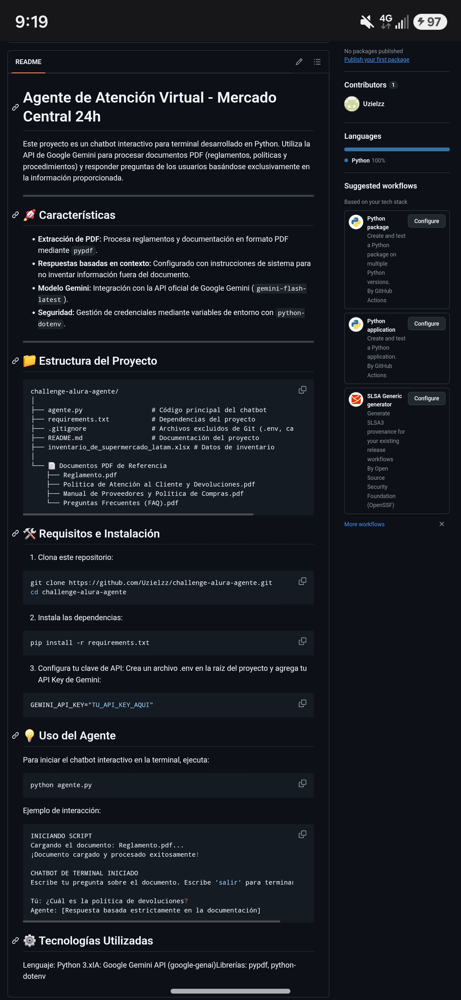

# Agente de Atención Virtual - Mercado Central 24h

Este proyecto es un chatbot interactivo para terminal desarrollado en Python. Utiliza la API de Google Gemini para procesar documentos PDF (reglamentos, políticas y procedimientos) y responder preguntas de los usuarios basándose exclusivamente en la información proporcionada.

---

## 🚀 Características

* **Extracción de PDF:** Procesa reglamentos y documentación en formato PDF mediante `pypdf`.
* **Respuestas basadas en contexto:** Configurado con instrucciones de sistema para no inventar información fuera del documento.
* **Modelo Gemini:** Integración con la API oficial de Google Gemini (`gemini-flash-latest`).
* **Seguridad:** Gestión de credenciales mediante variables de entorno con `python-dotenv`.

---

## 📁 Estructura del Proyecto

```text
challenge-alura-agente/
│
├── agente.py                  # Código principal del chatbot
├── requirements.txt           # Dependencias del proyecto
├── .gitignore                 # Archivos excluidos de Git (.env, cache, etc.)
├── README.md                  # Documentación del proyecto
├── inventario_de_supermercado_latam.xlsx # Datos de inventario
│
└── 📄 Documentos PDF de Referencia
    ├── Reglamento.pdf
    ├── Politica de Atención al Cliente y Devoluciones.pdf
    ├── Manual de Proveedores y Política de Compras.pdf
    └── Preguntas Frecuentes (FAQ).pdf
```
---
## 🛠️ Requisitos e Instalación
1. Clona este repositorio:
```bash
git clone https://github.com/Uzielzz/challenge-alura-agente.git
cd challenge-alura-agente
```
2. Instala las dependencias:
```bash
pip install -r requirements.txt
```
3. Configura tu clave de API:
Crea un archivo .env en la raíz del proyecto y agrega tu API Key de Gemini:
```bash
GEMINI_API_KEY="TU_API_KEY_AQUI"
```
---
## 💡 Uso del Agente

El agente se encuentra desplegado y listo para usarse en la nube a través de **Streamlit Cloud**.

### 🌐 Opción 1: Probar la aplicación en la web (Recomendado)

1. Accede a la aplicación desplegada mediante el enlace directo:
   👉 **[https://7crug5.streamlit.app](https://7crug5.streamlit.app)**

2. Una vez cargada la página, la interfaz confirmará automáticamente la lectura del documento PDF de referencia (`Preguntas Frecuentes (FAQ)`).

3. Escribe tu pregunta en la barra inferior de chat ("*Escribe tu pregunta aquí...*") y presiona **Enter** o el botón de enviar.

---

### 💻 Opción 2: Ejecución Local en Terminal

Si prefieres ejecutar el proyecto de forma local en tu máquina:

1. Ejecuta la aplicación de Streamlit con el siguiente comando:
    
   ```bash
   streamlit run agente.py
2. Se abrirá automáticamente una pestaña en tu navegador local (http://localhost:8501) con la interfaz interactiva.
---
### ❓ Preguntas de prueba sugeridas
​Puedes utilizar las siguientes consultas para verificar que el agente responde correctamente basándose de forma estricta en la documentación oficial:

​Horarios:``` ¿Cuáles son los horarios de operación de Mercado Central 24h? ```

​Ubicaciones:``` ¿Dónde están ubicadas las sucursales? ```

​Membresías:```¿Necesito una membresía para comprar en la tienda? ```

​Devoluciones:```¿Cuál es la política para la devolución de productos? ```

​Métodos de pago:``` ¿Qué métodos de pago son aceptados? ```

---

## 📸 Demostración de la Aplicación Desplegada

Así se ve la interfaz del bot respondiendo consultas en tiempo real dentro de Streamlit Cloud:



